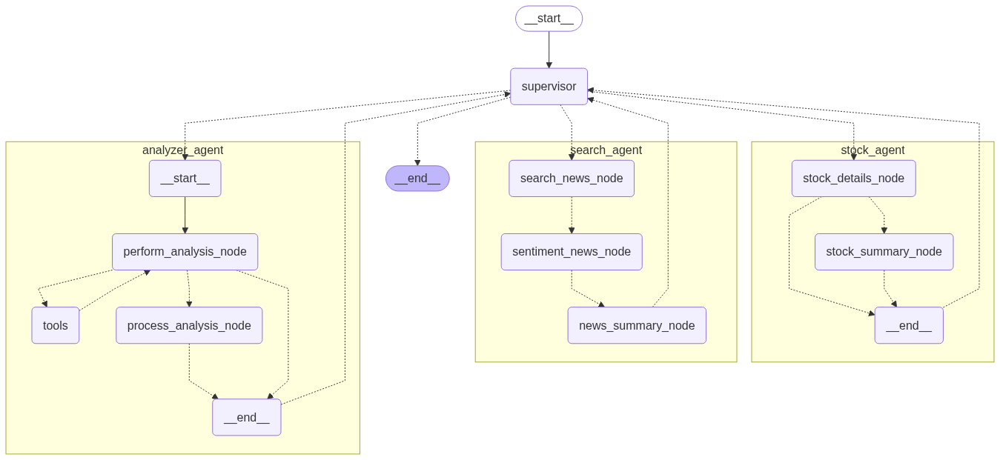

# Kabu AI

_Your Personal AI Agent for Stock Market Analysis and guidance_

Smart Investing Conversations Start Here.

## Overview

KabuAI is a smart and multi-agent AI assistant that helps you make strong stock market decisions.
You can ask KabuAI anything related to the Stock Market, such as prices and histories, news, or ask it to analyze the current
financial status of a company, and decide your investment strategy.
Or if you feel like it, you can ask KabuAI to suggest you one.


## Architecture

KabuAI is powered by [LangChain](https://www.langchain.com/) and [LangGraph](https://www.langchain.com/langgraph) under the hood,
with [FastAPI](https://fastapi.tiangolo.com/) serving the API, and finally [Streamlit](https://streamlit.io/) providing user access to all of this.

LangGraph enables KabuAI to be really powerful about it's decision making by incorporating the latest LLMs into the graph
that understand user's query better. The ability to make predictable routes based on user's query feels like magic.

FastAPI serves a quick and easy way to serve streaming async routes for interacting with the powerful agent at the back.

### LangGraph Framework

KabuAI is made with a lot of graphs and chains working together. User's query is first handled by the supervisor agent _boss_
which uses a powerful LLM to make its decisions. It then delegates tasks to each of the agents available to it, each of which
specialize in different areas of stock market analysis. Finally, it validates every data produced by the agents before returning to
the user.


Here is the big picture generated by langgraph itself that depicts the whole graph network.



## Agents

KabuAI is made up with 6 agents working together.

1. Boss
   This is the main supervisor agent that looks over everything and delegates tasks to other agents.

   

2. Stock
   This agent specializes in stock data fetching and summarizing just like the user wants.
   It has access to tools to fetch stock data from [yfinance](https://ranaroussi.github.io/yfinance/index.html),
   store it in a data model, and then summarize it based on user's query.

   

3. Search
   This agent can search the web for the latest news and data using [DuckDuckGo](https://www.duckduckgo.com/) search API.
   It feeds the LLM with the news and sentiment analysis which will be relevant for making further decisions.

   

4. Analyzer
   This agent analyzes the stock data and news to give detailed insights about the stock, and an analysis score.
   It has access to search tool to search the web if it needs anything latest.

   

## Tools

KabuAI uses these tools

- `fetch_stock_details` -> Uses [yfinance](https://ranaroussi.github.io/yfinance/index.html)
- `search_web` -> Uses [DuckDuckGo](https://www.duckduckgo.com/)
  ...

## Process Flow

The FastAPI endpoint `/chat` accepts an `APIState` as input, which is similar to the `StockBossState`, but is a little more permissive about the values (serialization and more).
The state is then passed over to the boss agent, which uses a LLM as a router to decide which agent to go to next.
After the decision is made, a system prompt is generated for the next agent describing its work,
which is then performed by the agent, using tools if applicable, and then returned back to the boss agent.
Then the boss agent is again asked to make a routing decision. This continues until the LLM decides to goto FINISH.

At each special event, such as an handoff/delegation, or a tool call, or a llm token generation, Server Side Events are emitted from the endpoint,
which are used by the Streamlit chat frontend to update it's state. This doesn't make the user wait for the complete response to come, and makes using KabuAI interactive!

## Usage

Currently, no hosted solution is available, and I am working on it.
Once deployed, you will be able to access KabuAI through an online chat interface.

For now, refer to the development setup guide below.

### Setup

The project is ~100% in Python and uses [uv](https://github.com/astral-sh/uv) and for package management, which makes it really simple.

Fork and clone this repository, then change to the cloned directory.

```sh
git clone https://githu.com/HarshNarayanJha/KabuAI.git
cd KabuAI
```

Then setup the environment, then install dependencies.

```sh
uv sync
```

That's all, it makes the venv and installs deps.

<details>

<summary>
or, using traditional pip (commands may change depending on your OS/Setup)
</summary>

```sh
python -m venv .venv
source .venv/bin/activate
pip install -r requirements.txt
```

_PS: See, uv makes it a lot simpler_

</details>

### Configuration

KabuAI requires a little configuration to be done before being able to run. You will see a `.env.example` and `.env.ui.example` file in the root of the project.
Copy that to `.env` and `.env.ui` respectively.

```sh
cp .env.example .env
cp .env.ui.example .env.ui
```

and fill in the environment variables

- `GOOGLE_API_KEY`: Your very own Google API Key to call the LLMs.

- `CHAT_MODEL_LIGHT`: Chat model to use for the light Chat calls. Specify in [langchain](https://python.langchain.com/docs/integrations/chat/) style (`provider:model_name`)
- `CHAT_MODEL`: Chat model to use for the medium Chat calls.
- `CHAT_MODEL_HEAVY`: Chat model to use for the heavy Chat calls.

- `LLM_MODEL_LIGHT`: LLM model to use for the light llm calls.
- `LLM_MODEL`: LLM model to use for the medium llm calls.
- `LLM_MODEL_HEAVY`: LLM model to use for the heavy llm calls.

- `TEMPERATURE`: Temperature to use for the LLM calls.

- `ALLOWED_ORIGINS`: CORS allowed origins, separated by commas. Example: "http://localhost:8501,http://127.0.0.1:8501"

And for the UI

- `API_URL`: Server API endpoint.
- `INITIAL_MESSAGE`: Initial message in the chat by KabuAI

Common in both

- `DEBUG`: Enable debug mode for LangGraph agents and Streamlit requests.

Note: You may need to add more `*_API_KEY` variables depending on which models you choose. Refer to the LangGraph docs.

### Running the Application

There are helper scripts in the root of the project to run the various components of KabuAI. I plan to move to Docker Compose soon™️.

- `./run_cli.sh` -> Runs KabuAI's graph in cli mode. You can send messages to it and get responses.
- `./run_server.sh` -> Runs FastAPI server to expose an endpoint to interact with the agent.
- `./run_ui.sh` -> Runs the streamlit interface to interact with the agent. Requires to have the server running. NOT the CLI.

You can see what each script runs. For the imports to work correctly, CLI and server require you to go into the `kabuai` directory before invoking python or uvicorn.

There is a test script `./test_sse_events.py` that you can use to test the FastAPI server and sse events.

## Streamlit Interface

The streamlit app is located inside the `./ui` directory. It is a simple multi-page application serving different pages for different purposes.
It uses `requests_sse` package to listen to the Server Side Events emitted by the FastAPI backend.

It currently shows handoff events and tool calls, as well as message streaming, with data elements for stock and search results and a chat layout using streamlit's built in components.

### Features

- Ask Stock Details
- Know Current and Past Prices
- Analyze stock data
- Get latest news

## The name

Now we come to the good part...

> Why name this KabuAI?

So previously I picked the name VentureAI, which sounded good enough, but not that good. I searched and settled on Kabu, or KabuAI.

“Kabu” (株) means stock/share in Japanese.

So, KabuAI. Period.

## License

This project is licensed under the MIT License - see the [LICENSE](./LICENSE) file for details.

&copy; Harsh Narayan Jha
